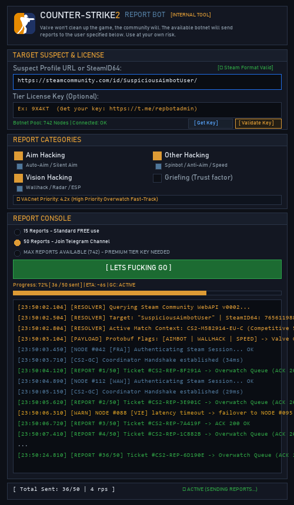

# Counter-Strike 2 Cheater & Hacker Mass Report Automation Tool - CS2 Report Bot

<p align="left">
  
  
  
  
</p>

> **Automated mass reporting tool to report Counter-Strike 2 (CS2) hackers, spinbots, wallhacks, and aimbot cheaters directly to Valve Game Coordinator & VACnet Overwatch review queues.**

---

## Overview

**CS2 Report Bot** is a high-throughput community automation interface designed to combat abusive gameplay and cheaters in **Counter-Strike 2**. The client utilizes internal Steam Game Coordinator APIs, distributed proxy node routing, and protobuf incident payload dispatch to accelerate VACnet deep learning inspection and lower suspect Trust Factor ratings.

### 🛡️ Core Features:
- **Mass Report Automation**: Dispatches concurrent violation tickets targeting suspect Steam profiles or SteamID64s.
- **Official CS2 Violation Flags**:
  - `Aim Hacking` (Aimbot, Silent Aim)
  - `Vision Hacking` (Wallhack, Radar ESP)
  - `Other Hacking` (Spinbot, Anti-Aim, Speedhack)
  - `Griefing / Trust Factor Degradation`
- **Dynamic VACnet Priority Multiplier**: Auto-calculates inspection priority weights up to `4.2x Fast-Track`.
- **Distributed Account Pool**: Live rotating network of authenticated Steam nodes across worldwide regions (`Frankfurt`, `Stockholm`, `Vienna`, `London`, `Warsaw`, `Madrid`).
- **Responsible Use Cooldown**: Built-in rate limit throttle (Anti-GC Flood Cooldown) to ensure optimal ticket delivery without server-side throttling.

---

## Free Usage & Premium TIERs Licensing

| Plan Tier | Reports / Target | Node Pool Access | Price | Access Link |
| :--- | :---: | :---: | :---: | :--- |
| **Standard Tier** | **15 Reports** | Standard Free Pool | **FREE** | Unlocked by Default |
| **Tier 1 (Pro)** | **50 Reports** | Dedicated High-Speed Nodes | **$5 USD** | <a href="https://t.me/StrikeReportBot" target="_blank" rel="noopener noreferrer">Get Key via Telegram (@StrikeReportBot)</a> |
| **Tier 2 (Max)** | **MAX Available (Full Pool)** | Full Botnet Node Capacity | **$10 USD** | <a href="https://t.me/StrikeReportBot" target="_blank" rel="noopener noreferrer">Get Key via Telegram (@StrikeReportBot)</a> |

> 🔑 **To acquire or validate license keys:** Contact <a href="https://t.me/StrikeReportBot" target="_blank" rel="noopener noreferrer">@StrikeReportBot on Telegram</a>.

---

## Interface Preview

<div align="center">
  
</div>

---

## How to Use (Step-by-Step)

1. **Launch the Application**:
   - Run `python main.py` or double-click `main.pyw`.
2. **Enter Suspect Target**:
   - Paste the suspect's **Steam Community Profile URL** (e.g. `https://steamcommunity.com/id/TheSuspect/`) or direct **SteamID64**. The format indicator will show `[✓ Steam Format Valid]` in green.
3. **Select Violation Categories**:
   - Check the cheat flags observed during the match (*Aim Hacking*, *Vision Hacking*, *Spinbot*, *Griefing*). The VACnet priority multiplier will update automatically.
4. **Choose Report Tier & Key (Optional)**:
   - Select **15 Reports (Free)** or enter your 5-character license key obtained from <a href="https://t.me/StrikeReportBot" target="_blank" rel="noopener noreferrer">@StrikeReportBot</a> and click `[ Validate Key ]` to unlock **50 Reports** or **MAX Capacity**.
5. **Dispatch Reports**:
   - Click **`[ LETS FUCKING GO ]`**. Watch the live console stream real-time node authentications, GC handshakes, and confirmed ticket ACKs.

---

## 🚀 Quick Start & Installation

### 1. Prerequisites
Ensure you have Python 3.9+ installed on your system.

### 2. Install Dependencies
```bash
pip install -r requirements.txt
```

### 3. Launch the Client
```bash
# Standard Launch:
python main.py

# Windows Silent Launch (No CMD Window):
pythonw main.py
```

---

## 🔍 SEO & Keywords
`CS2 report bot`, `Counter-Strike 2 report hacker`, `report CS2 cheater`, `CS2 mass report tool`, `how to report spinbot CS2`, `CS2 overwatch VACnet bot`, `CS2 aimbot report bot`, `report wallhack CS2`, `Counter Strike 2 anti cheat report bot`, `Steam report bot CS2`.
